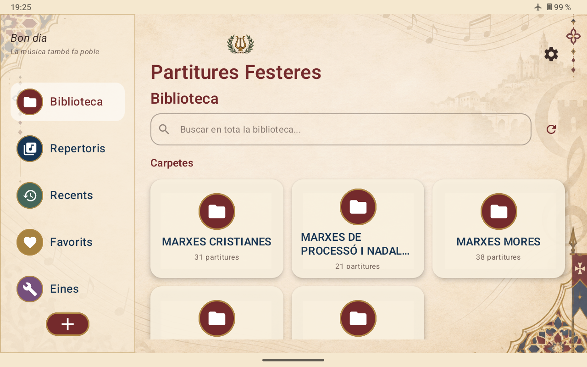
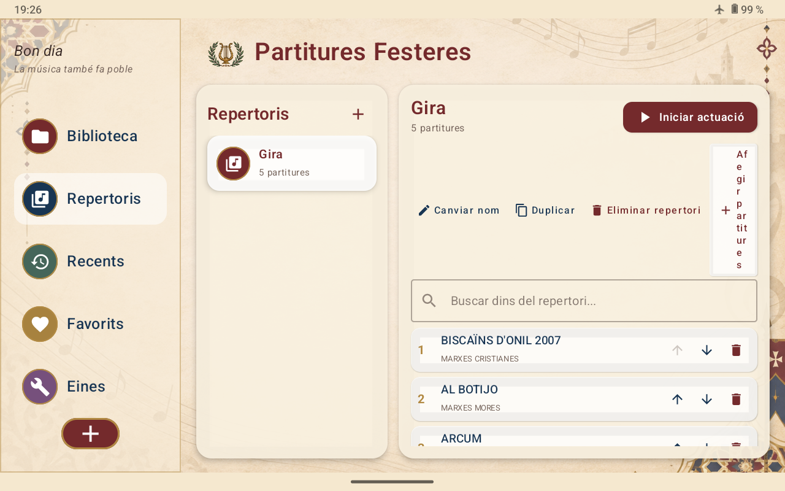
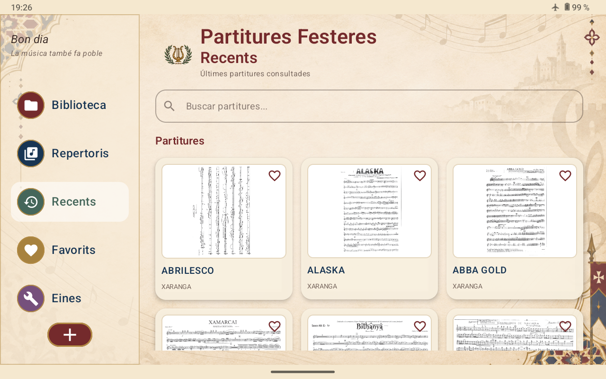
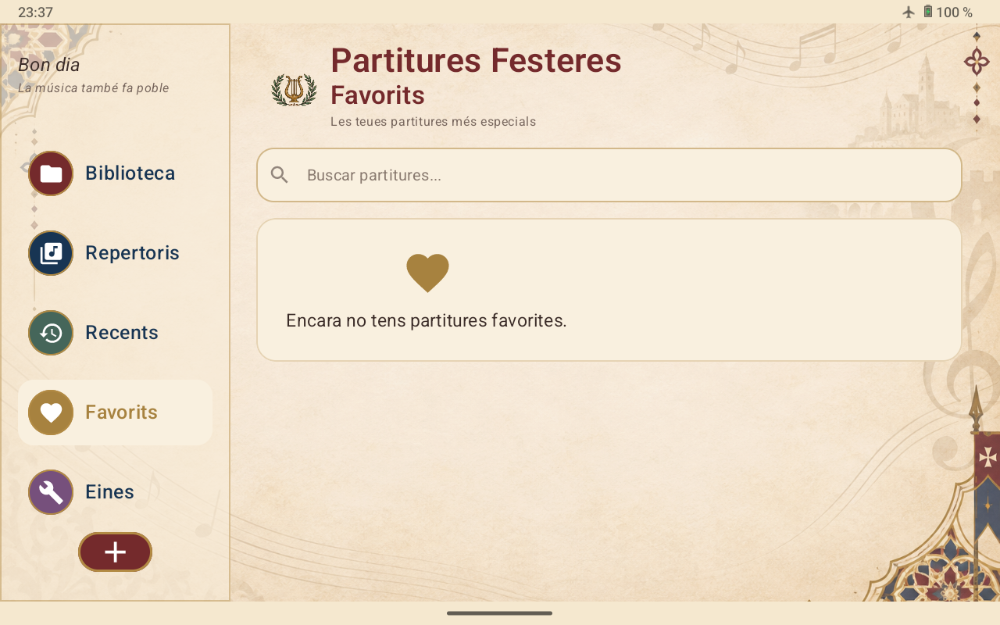
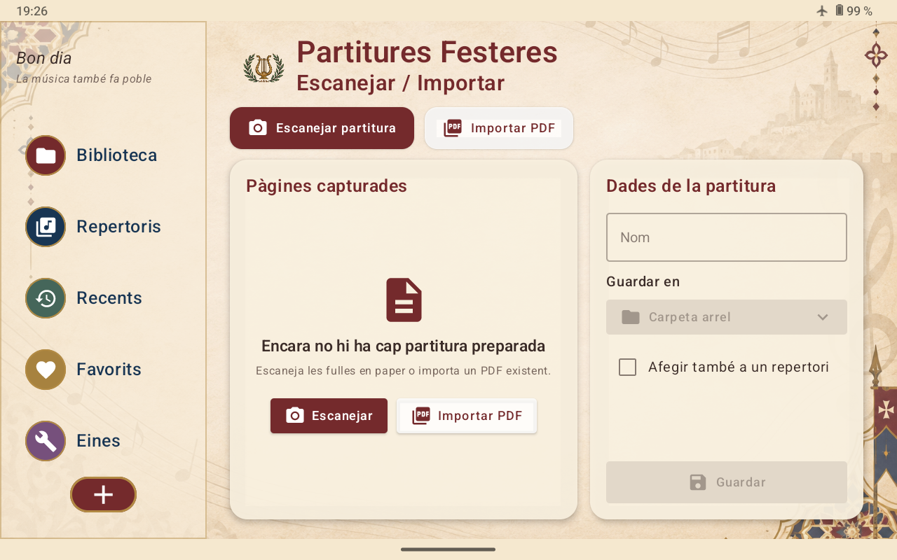
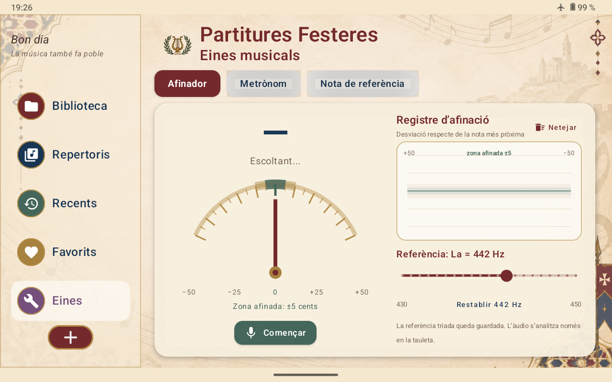
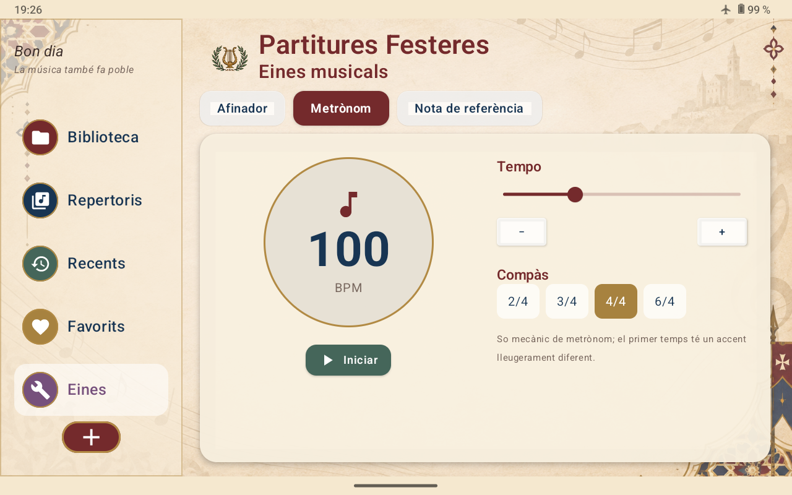
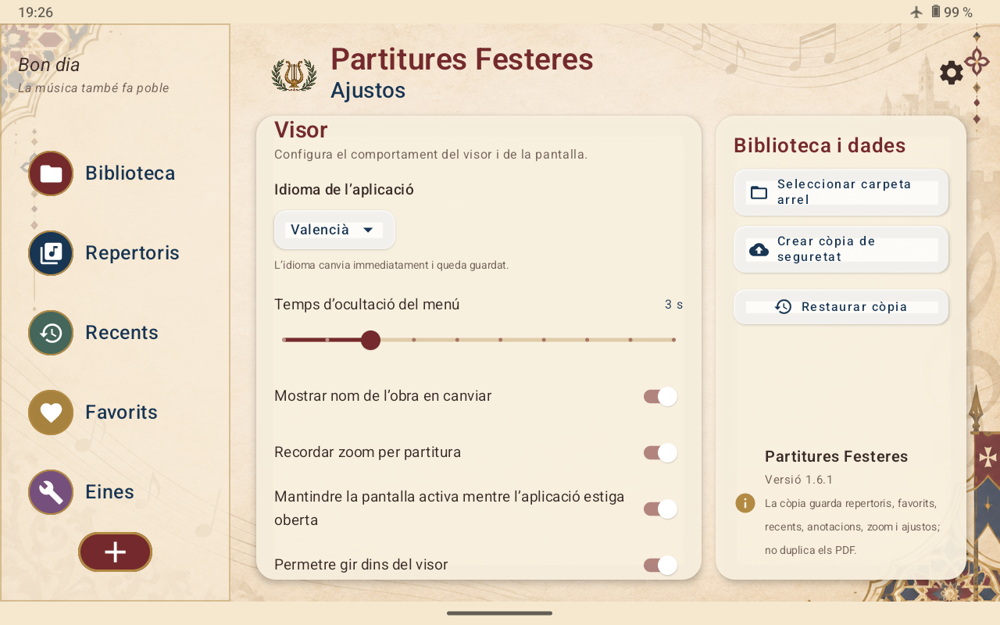

# Guía de uso — Partitures Festeres

[Valencià](GUIA_US_va.md) · [Español] · [English](USER_GUIDE_en.md)

Esta guía explica las funciones principales de **Partitures Festeres** y cómo utilizarlas durante ensayos, actuaciones y desplazamientos.

> Las capturas corresponden a una versión reciente de la aplicación. Algunos textos o detalles visuales pueden variar ligeramente entre versiones.

## 1. Primera configuración

Al abrir la aplicación por primera vez, selecciona la **carpeta raíz** donde guardas las partituras.

La biblioteca se construye a partir de las carpetas reales del dispositivo. Cada subcarpeta aparece automáticamente como una categoría de la biblioteca, de forma que puedes conservar la misma organización que ya utilizas en tus archivos.

La carpeta raíz puede cambiarse posteriormente desde **Ajustes**.

## 2. Biblioteca

La sección **Biblioteca** es el punto principal de acceso a las partituras.

Desde aquí puedes:

- navegar por las carpetas de partituras;
- buscar una obra en toda la biblioteca;
- abrir una partitura;
- actualizar la biblioteca si has añadido, eliminado o reorganizado archivos.

La aplicación lee dinámicamente las carpetas existentes, por lo que no es necesario crear categorías dentro de la app.

## 3. Repertorios

Los **Repertorios** permiten crear listas propias de partituras para una actuación concreta, concierto, entrada, procesión o cualquier otra situación.

Puedes:

- crear varios repertorios;
- añadir o eliminar partituras;
- cambiar el orden de las obras;
- duplicar o cambiar el nombre de un repertorio;
- iniciar una actuación para recorrer las partituras en el orden establecido.

Esto permite preparar antes de salir a tocar exactamente las obras que vas a necesitar.

## 4. Recientes

La sección **Recientes** muestra las últimas partituras consultadas.

Es útil para volver rápidamente a una obra sin tener que buscarla de nuevo en la biblioteca.

## 5. Favoritos

Puedes marcar las partituras que utilizas con más frecuencia como **Favoritos**.

Esta sección ofrece acceso directo a las obras que quieres tener siempre localizadas.

## 6. Escanear e importar partituras

El botón **+** abre las opciones para incorporar nuevas partituras.

Puedes:

- **Escanear partitura**: digitalizar páginas en papel con la cámara.
- **Importar PDF**: añadir un PDF existente a tu archivo.

Antes de guardar puedes indicar el nombre de la partitura, elegir la carpeta de destino y, si quieres, añadirla también a un repertorio.

## 7. Visor de partituras

Al abrir una partitura, el visor está pensado para ocupar el máximo espacio posible y facilitar la lectura.

La misma lógica de navegación se utiliza tanto en orientación horizontal como vertical: simplemente gira físicamente la tableta y la aplicación se adapta.

En **Ajustes** puedes configurar opciones del visor como:

- tiempo de ocultación del menú;
- mostrar el nombre de la obra al cambiar;
- recordar el zoom de cada partitura;
- mantener la pantalla activa;
- permitir el giro dentro del visor.

## 8. Herramientas musicales

La sección **Herramientas** incorpora utilidades pensadas para el ensayo y la actuación.

### Afinador

Utiliza el micrófono del dispositivo para mostrar la desviación de la nota respecto a la afinación correcta.

La referencia de afinación puede ajustarse según las necesidades del grupo.

### Metrónomo

Permite seleccionar el tempo y el compás e iniciar un pulso regular para el estudio o ensayo.

### Nota de referencia

Genera una nota continua desde el dispositivo.

Puedes seleccionar la nota, la octava y ajustar la frecuencia de referencia. También hay accesos rápidos a notas habituales.

## 9. Ajustes, copia de seguridad e idioma

Desde **Ajustes** puedes:

- cambiar entre valenciano y castellano;
- seleccionar una nueva carpeta raíz;
- crear una copia de seguridad;
- restaurar una copia anterior;
- modificar el comportamiento del visor.

La copia de seguridad conserva la información propia de la aplicación —repertorios, favoritos, recientes, anotaciones, zoom y ajustes— pero no duplica los archivos PDF.

## 10. Recomendaciones de uso

Para una actuación resulta práctico:

1. mantener las partituras ordenadas por carpetas;
2. crear un repertorio específico antes de salir;
3. ordenar las obras según el orden previsto;
4. marcar como favoritas las partituras de uso frecuente;
5. realizar periódicamente una copia de seguridad de la configuración.

## Ayuda y sugerencias

Si detectas un error o tienes una propuesta de mejora, puedes utilizar la sección **Issues** del repositorio de GitHub.

© 2026 Santi Milla Navarro
